# OMCUSS

大学などにおける健康診断業務のためのオープンソースシステムです。

# 機能紹介

メニュー

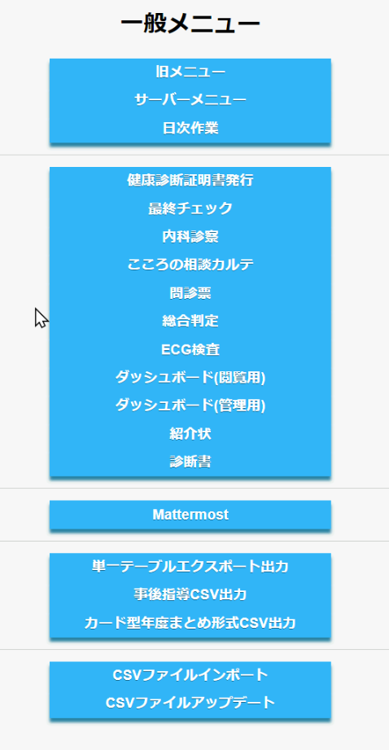

# 健康診断証明書発行
健康診断証明書を発行します。
検索画面

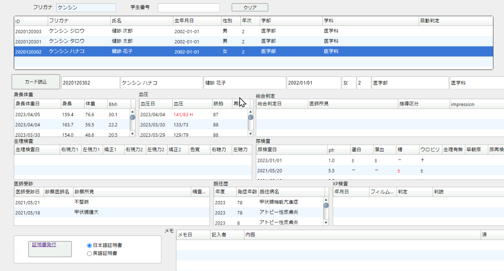
発行画面

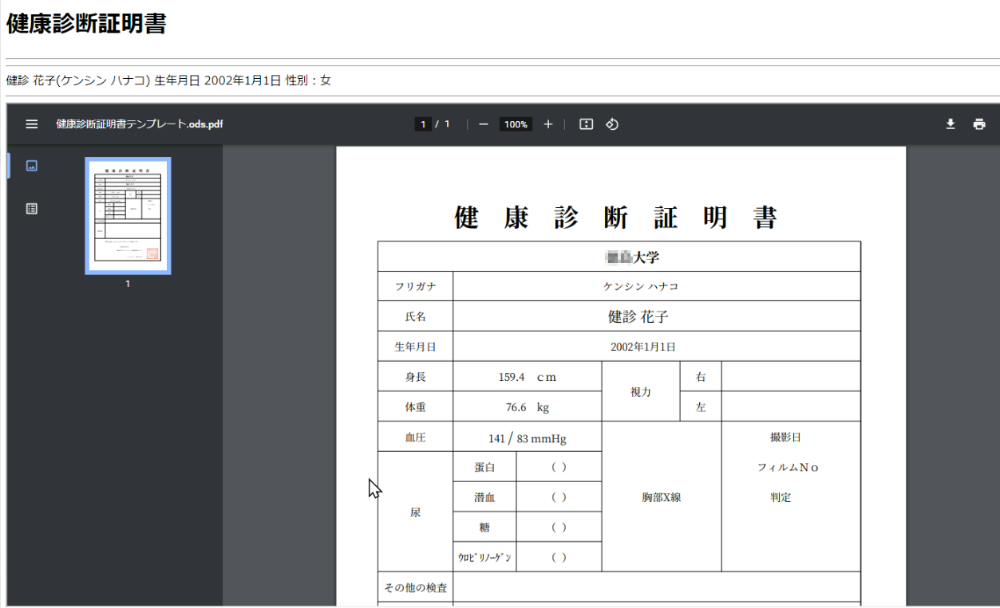

# 最終チェック
健康診断時に、受診者が当日の健康診断値のセルフチェックを行う画面です。
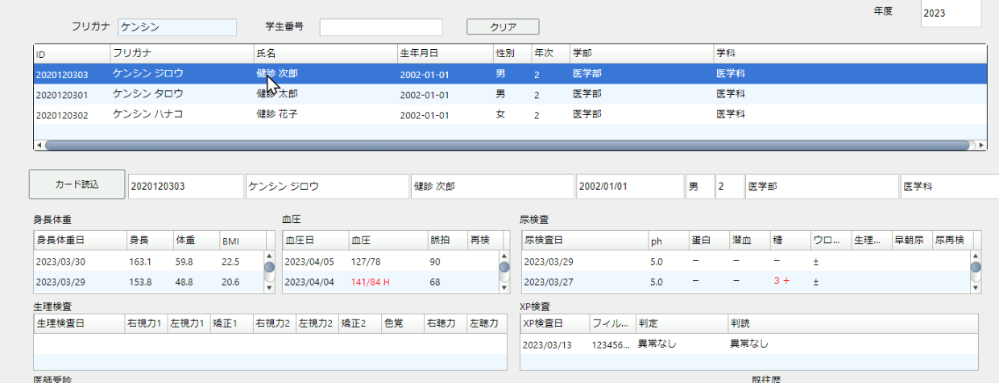
診断を全て行ったか、測定ミスが無いかなどを確認します。
データは当年度のみの表示です。

# 内科診察
既往病、診察所見を登録します。
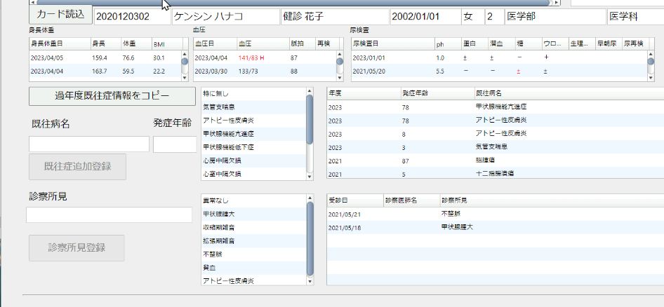
健康診断時に毎年度内科医による診察を行います。そのときに既往症情報は過年度に登録した内容に変更がなければ、「過年度既往症情報をコピー」ボタンで一度にコピーできます。
# こころの相談カルテ
こころの相談用の、書き込み用カルテを出力します。
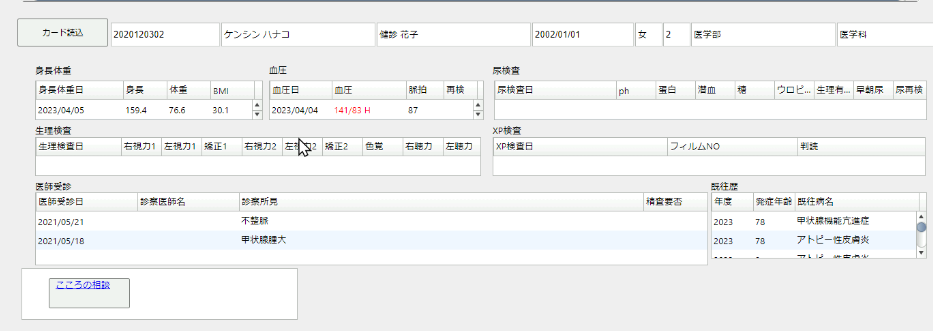
カルテ出力画面
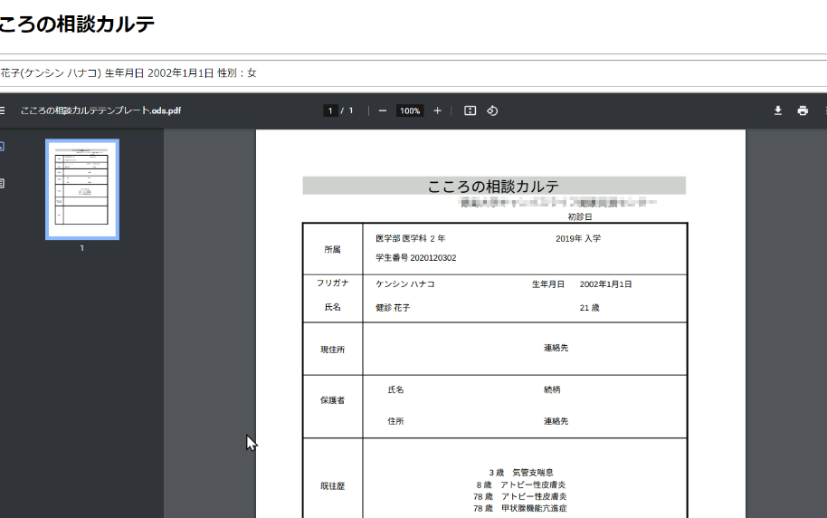
なおこのカルテは、紙での処理を行い、カルテ書き込み内容は当システムでは記録しません。
# 総合判定
医師所見による、呼び出し判定を登録します。
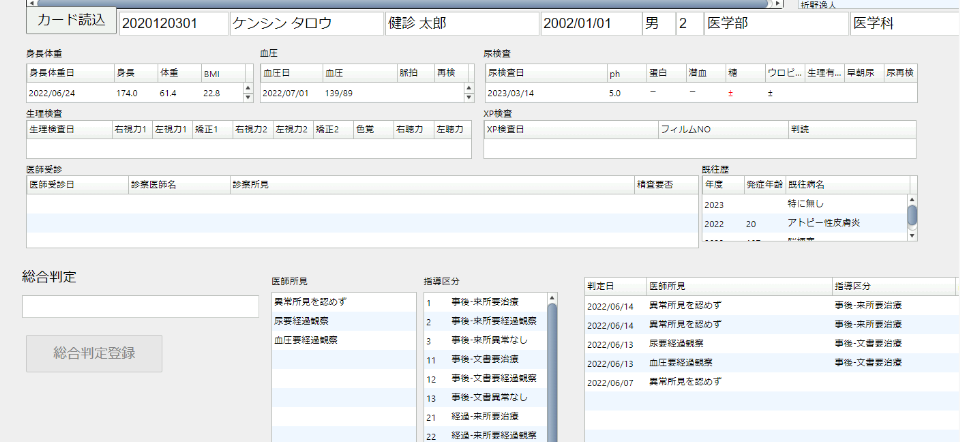

# ECG検査
ECG情報の登録・閲覧ができます。
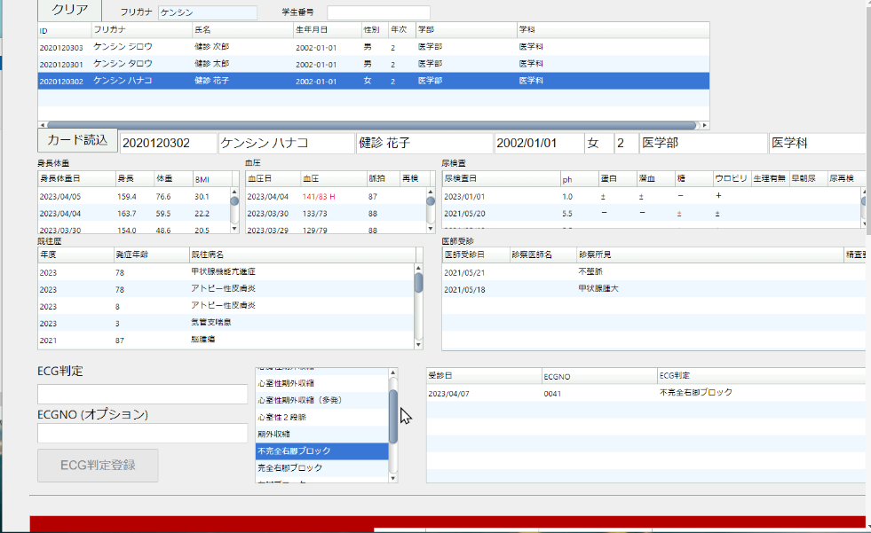

ECG情報の削除もできますが、当期のデータのみ削除できるようになっています。
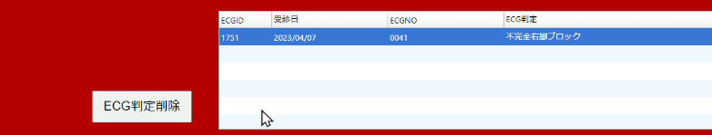

# ダッシュボード(閲覧用)

個人のすべてのデータが一覧できます。
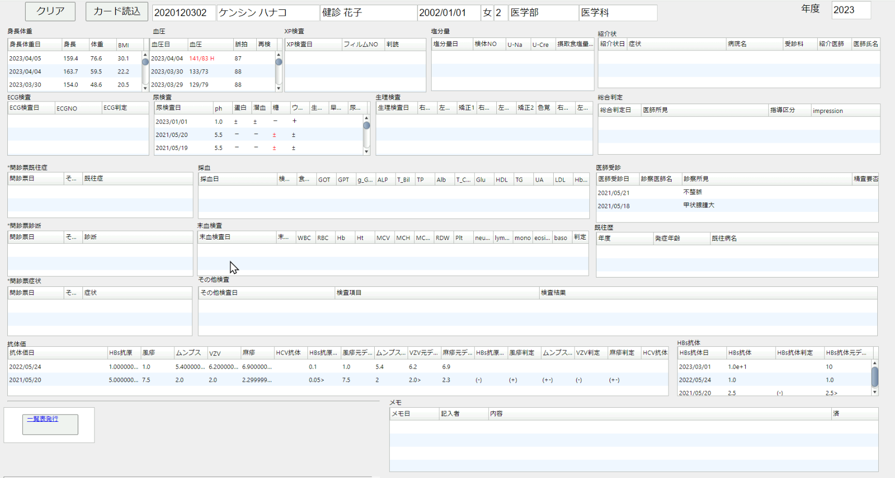

# ダッシュボード(管理用)

ダッシュボード(閲覧用)の機能に加え、データの編集や削除、追加ができます。
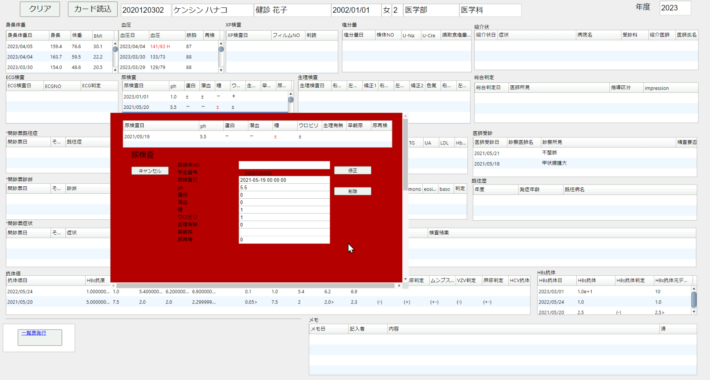
検診データの改ざんとならないように、この画面の使用は限られたルールに従ってください。

# 紹介状
紹介状の発行ができます。
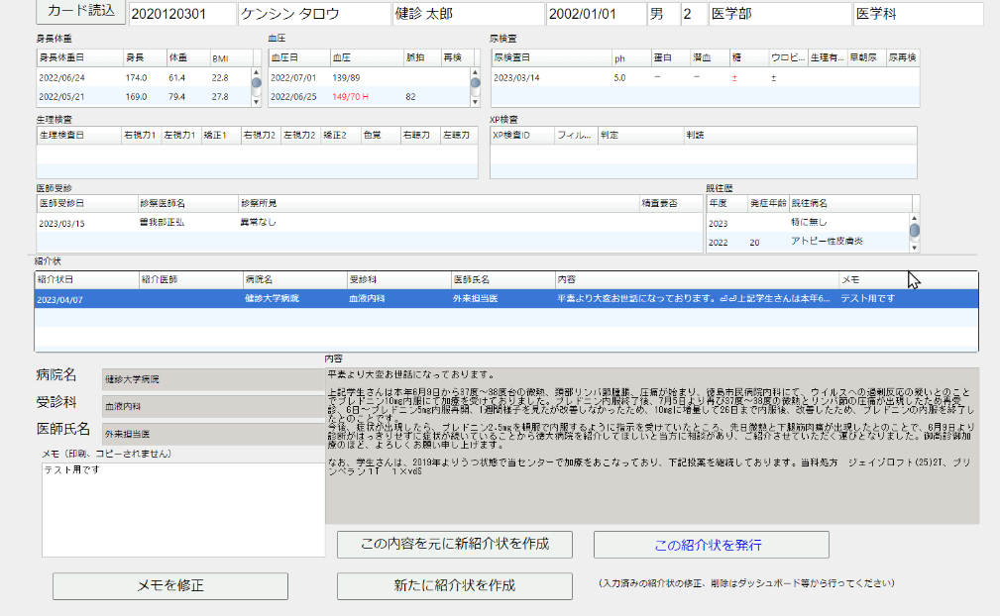
紹介状発行画面
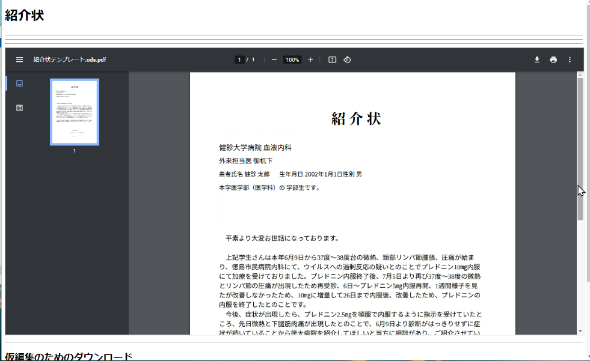
# 診断書
診断書の発行ができます。

# サーバ管理
サーバーメニュー、日次作業において、メンテナンスなどを行います。

# データ管理

 単一テーブルエクスポート出力、 事後指導CSV出力、 カード型年度まとめ形式CSV出力、CSVファイルインポート、CSVファイルアップデートにおいて、データ出力などを行います。

