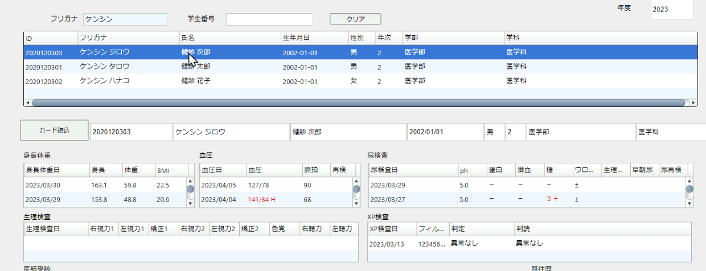
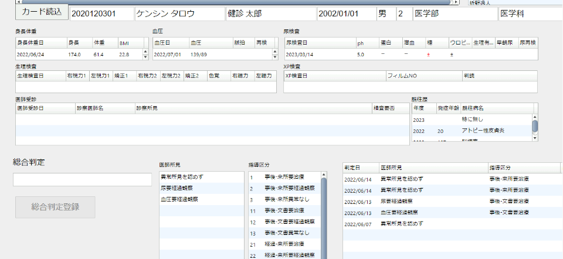
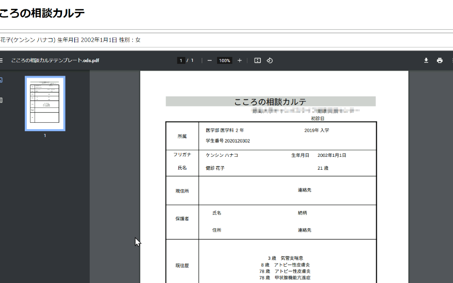
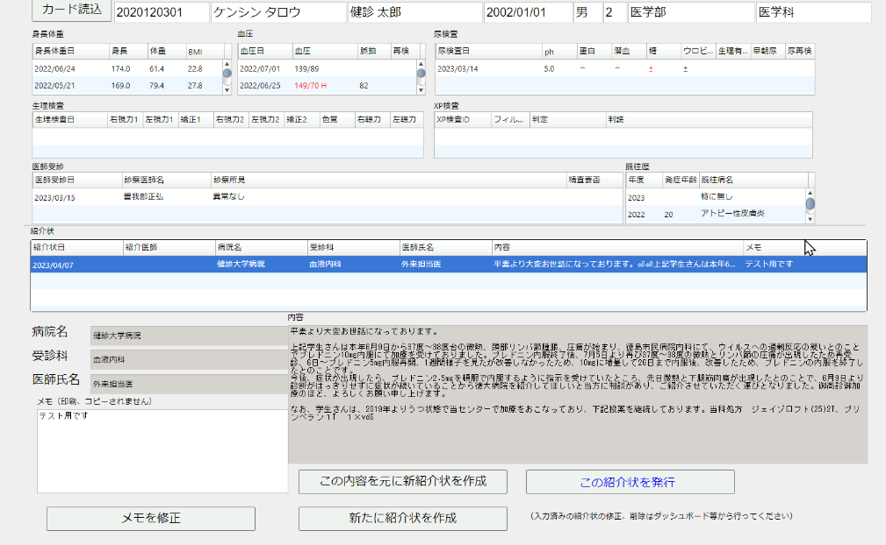

# 使用方法

## 目次

- [使用方法](#使用方法)
  - [目次](#目次)
- [毎日の業務(業務開始時)](#毎日の業務業務開始時)
- [定期的なメンテナンス](#定期的なメンテナンス)
  - [バックアップ](#バックアップ)
  - [バックアップファイルのダウンロード](#バックアップファイルのダウンロード)
- [健康診断の実施](#健康診断の実施)
  - [身体測定機のセットアップ](#身体測定機のセットアップ)
  - [身体測定機の利用](#身体測定機の利用)
  - [IoT マイクロサーバのセットアップ](#iot-マイクロサーバのセットアップ)
  - [スタンドアローン受付サーバのセットアップ](#スタンドアローン受付サーバのセットアップ)
  - [スタンドアローン受付サーバの利用](#スタンドアローン受付サーバの利用)
  - [最終チェック画面の用意](#最終チェック画面の用意)
- [データ閲覧システム](#データ閲覧システム)
  - [検索方法(共通)](#検索方法共通)
  - [メモ機能(共通)](#メモ機能共通)
  - [内科診察](#内科診察)
  - [総合判定](#総合判定)
  - [ECG検査](#ecg検査)
  - [ダッシュボード(閲覧用)](#ダッシュボード閲覧用)
  - [ダッシュボード(管理用)](#ダッシュボード管理用)
- [帳票発行システム](#帳票発行システム)
  - [帳票印刷の一部修正(共通)](#帳票印刷の一部修正共通)
  - [テンプレートの修正(共通)](#テンプレートの修正共通)
  - [健康診断証明書発行](#健康診断証明書発行)
    - [検索画面](#検索画面)
    - [発行画面](#発行画面)
  - [こころの相談カルテ](#こころの相談カルテ)
    - [カルテ出力画面](#カルテ出力画面)
  - [検査結果一覧](#検査結果一覧)
  - [紹介状](#紹介状)
    - [紹介状発行画面](#紹介状発行画面)
  - [診断書](#診断書)
- [データインポート、エクスポート](#データインポートエクスポート)
  - [単一テーブルエクスポート出力](#単一テーブルエクスポート出力)
  - [事後指導CSV出力](#事後指導csv出力)
  - [カード型年度まとめ形式CSV出力](#カード型年度まとめ形式csv出力)

# 毎日の業務(業務開始時)

メニューから「日次作業」-「XOJOサーバ再起動」を行ってください

メニューから「Mattermost」を選び、システム更新のお知らせなどを確認してください。

# 定期的なメンテナンス

## バックアップ
メニューから「サーバーメニュー」-「バックアップ」-「データベースバックアップ」を行ってください。

## バックアップファイルのダウンロード

メニューから「サーバーメニュー」-「バックアップ」-「バックアップファイルダウンロード」を行ってください。

# 健康診断の実施

## 身体測定機のセットアップ

- IoTアダプタに有線LANを接続
- IoTアダプタと身体測定機を接続
- IoTアダプタに対応するプログラムの入ったのUSBメモリを装着

- IoTアダプタの電源を接続、「Ready」になるまで待つ
- テストカードを使い、測定値が登録されるかテスト

## 身体測定機の利用

- IoTアダプタに「Ready」と表示されていることを確認する
- IoTアダプタにICカードをタッチする
- ピッと鳴って個人番号が表示される
- 身体測定を行う
- IoTアダプタに測定値が表示される
- しばらくするとIoTアダプタに「Ready」と表示される

## IoT マイクロサーバのセットアップ

- 尿検査、カード忘れについてはマイクロサーバ内の画面で処理を行います。
- IoTアダプタに有線LANを接続
- IoTアダプタに対応するマイクロサーバプログラムの入ったUSBメモリを装着
- IoTアダプタの電源を接続、IPアドレスが表示されるまで待つ
- 表示されたIPアドレスを操作PCのWebブラウザのアドレスに入力する
- 尿検査、カード忘れいずれかを選ぶ
- 尿検査の場合はIoTマイクロサーバに尿検査機を接続してください。
  

## スタンドアローン受付サーバのセットアップ

- XP受付、血液検査受付、尿検体受付の場合
- IoTアダプタに有線LANを接続
- IoTアダプタに対応するプログラムの入ったのUSBメモリを装着
- IoTアダプタの電源を接続、IPアドレスが表示されるまで待つ
- 表示されたIPアドレスを操作PCのWebブラウザのアドレスに入力する
- 「個人データファイル作成」で個人マスタを反映しておく

## スタンドアローン受付サーバの利用

XP受付、血液検査受付、尿検体受付については健康診断実施後に検査結果が外部よりCSVデータとしてもたらされるので、健康診断時には受付番号と個人番号をひもづけたデータを記録するようになります。
受付時には ICカードを読み込みます。受付データはUSBメモリにCSVデータとして記録されていきます。受付時間が終わった後にCSVデータを取り出して外注業務に使用します。
なお、受付作業はネットワーク接続がない状態で行いますので、事前に個人マスタを受付サーバに反映しておく必要があります。

- IoTアダプタと操作PCを有線LANで直接接続
- IoTアダプタに対応するプログラムの入ったのUSBメモリを装着
- IoTアダプタの電源を接続、IPアドレスが表示されるまで待つ
- 表示されたIPアドレスを操作PCのWebブラウザのアドレスに入力する
- XP受付、血液検査受付、尿検体受付いずれかを選ぶ
- 日付設定および通し番号の設定を表示された画面で行ってください

## 最終チェック画面の用意

健康診断時に、受診者が当日の健康診断値のセルフチェックを行う画面です。

診断を全て行ったか、測定ミスが無いかなどを確認します。
データは当年度のみの表示です。

# データ閲覧システム

内科診察、総合判定、ECG検査、ダッシュボードのデータが閲覧できます。

## 検索方法(共通)
フリガナによる検索

かなを入力すると、カタカナに変換して候補が表示されます。
一部の入力でも、入力からはじまる候補を検索します。
該当が多いときには表示に時間がかかるので、なるべく絞り込める内容で入力してください。

学生番号による検索

番号を入力すると、半角に変換して候補が表示されます。
一部の入力でも、入力からはじまる候補を検索します。
該当が多いときには表示に時間がかかるので、なるべく絞り込める内容で入力してください。

カード読み込みボタン

ボタンを押して、接続したカードリーダーにICカードをタッチすると該当の個人が表示されます。

## メモ機能(共通)

個人に対し、メモを入力できます。

このメモは誰でも入力・編集・削除ができます。

## 内科診察
既往病、診察所見を登録します。

健康診断時に毎年度内科医による診察を行います。そのときに既往症情報は過年度に登録した内容に変更がなければ、「過年度既往症情報をコピー」ボタンで一度にコピーできます。

## 総合判定
医師所見による、呼び出し判定を登録します。

## ECG検査
ECG情報の登録・閲覧ができます。

ECG情報の削除もできますが、当期のデータのみ削除できるようになっています。

## ダッシュボード(閲覧用)

個人のすべてのデータが一覧できます。

## ダッシュボード(管理用)

ダッシュボード(閲覧用)の機能に加え、データの編集や削除、追加ができます。

検診データの改ざんとならないように、この画面の使用は限られたルールに従ってください。

# 帳票発行システム

## 帳票印刷の一部修正(共通)

印刷内容を一部変更したい場合は、「仮編集のためのダウンロード」を押してダウンロードした内容をLibreOfficeにて修正、印刷してください。

## テンプレートの修正(共通)

## 健康診断証明書発行

健康診断証明書を発行します。

### 検索画面

### 発行画面

## こころの相談カルテ

こころの相談用の、書き込み用カルテを出力します。

### カルテ出力画面

なおこのカルテは、紙での処理を行い、カルテ書き込み内容は当システムでは記録しません。

## 検査結果一覧

ダッシュボードから、検査結果一覧表を出力できます。

## 紹介状

紹介状の発行ができます。

### 紹介状発行画面

## 診断書

診断書の発行ができます。

# データインポート、エクスポート

## 単一テーブルエクスポート出力

対応テーブルをCSVファイルでのダウンロードができます。

## 事後指導CSV出力

事後指導のための、あらかじめ決められた条件で抽出したリストを年度ごとに出力できます。

## カード型年度まとめ形式CSV出力

個人ごとの年度内の検査データすべてを1レコードにまとめた、全員分のCSVデータを年度指定で作成します。

レコード内のデータのフォーマットによって、「年度まとめ」と『健康診断自動発行用データ作成」が選べます。

